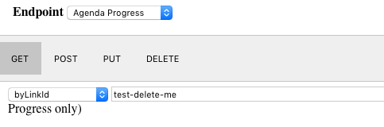

Step 1: Submission
======================

(1) Authorization
=====================

@todo add auth docs.

(2) Determine your payload API and Endpoint
===============================================

POP's language is Agenda. The Agenda defines the workflow to be executed. In that, there are several endpoints that will in the end submit an Agenda. The simplest is an actual Agenda. The most feasible is the JSON + Agenda Template. 

Agenda
------

The workflow the Priority Operation Processing (POP) software will schedule and run. See [Agenda](AgendaAPI)

JSON + Agenda Template
----------------------

An Agenda Template that defines the Agenda to build with the incoming JSON payload as input. The result is an expressed Agenda for execution.

See [Agenda Template](AgendaTemplateAPI) for creating an Agenda Template

See [Agenda](AgendaAPI) for submission with your payload


(3) Submitting via WebPOP
=================================

You can use our Java client, or do direct submissions via the website UI. [website](./website/UI)


1.  @todo Add docs on how to use website

    Click here for example Agenda for Sample handler
```
    {
    "cid": "testCid-deleteme",
    "customerId": "http://my.account.id/Account/2954979340",
    "operations": \[
    {
    "payload": {
    "actions": \[
    {
    "action": "exception",
    "paramsMap": {
    "sleepMilliseconds": 30000,
    "logMessage": "This is a custom log message",
    "exceptionMessage": "This is a custom exception message."
    }
    }
    \],
    "resultPayload": {
    "data": "someData"
    }
    },
    "type": "sample",
    "id": "[op1.id](http://op1.id)",
    "name": "[op1.name](http://op1.name)"
    }
    \],
    "jobId": "theJob",
    "linkId": "test-delete-me"
    }
```
5.  Select the Agenda Progress endpoint

    
6.  Select byLinkId and add your linkId


You will see your progress for the resulting Agenda. NOTE: The above payload intentionally triggers an error on the Sample handler. Remove the entire exceptionMessage line to run a successful Agenda.

Troubleshooting: Agenda Insight Not Found
-----------------------------------------

You have submitted an Agenda or AgendaTemplateID + payload that could not map to an Insight/Queue. Your Agenda didn't have an operation or parameter that was needed to determine the appropriate Insight.

We have a feature request to support a general queue, but for now we want to make sure we've approved the work submitted.
You can make sure your Customer entry in the table has a resourcePoolId, and an Insight with the same resourcePoolId matches the criteria in your Agenda.

### Example:

See how POP binds an Agenda to an Insight Queue for processing : [2. Scheduling](Scheduling)
